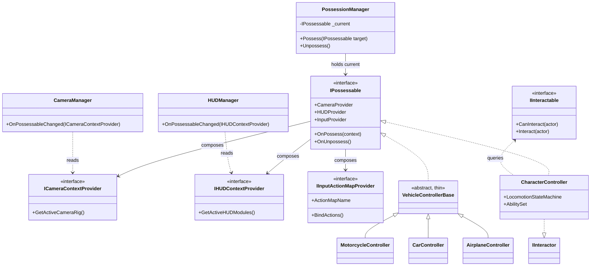
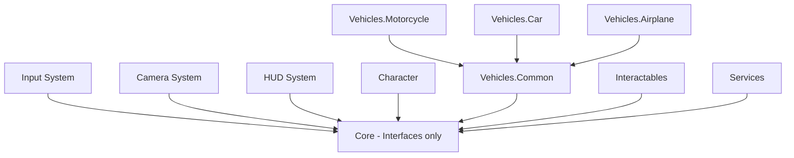
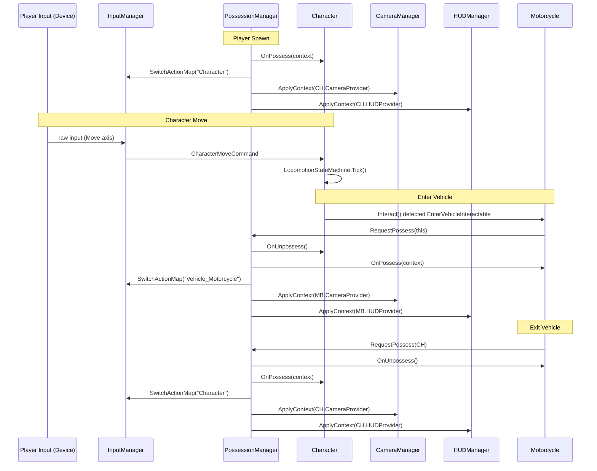

# Gameplay Framework Architecture — Possession-Based Multi-Entity Control System

*Tài liệu thiết kế kiến trúc cho Unity 6 / URP / New Input System / Cinemachine*

---

## Lời mở đầu của Lead Gameplay Programmer

Trước khi đi vào thiết kế, tôi muốn phản biện một vài giả định trong brief, vì đây là trách nhiệm của một Lead khi nhận yêu cầu:

- **"Framework tuyệt đối không phụ thuộc Vehicle Type"** — đúng về nguyên tắc, nhưng tuyệt đối 100% là không thực tế. Sẽ luôn có một số chỗ (ví dụ HUD icon mặc định, sound category) cần một mảnh dữ liệu nhận diện loại thực thể cho mục đích UX/Audio/Analytics. Giải pháp là dùng **string ID hoặc ScriptableObject reference**, không dùng `enum VehicleType`, để việc thêm loại mới không đụng vào enum dùng chung ở nhiều nơi (đây là nguồn Open/Closed Principle bị vi phạm phổ biến nhất).
- **HFSM cho mọi thứ** — tôi sẽ đề xuất dùng State Machine có chọn lọc, không phải vì "best practice" mà vì Character Locomotion thực sự có state phân tầng (Grounded → Idle/Walk/Run), trong khi nhiều Ability (Interact, Push) chỉ là hành vi tạm thời, không cần state riêng.
- **Không dùng Singleton** — tôi đồng ý về nguyên tắc nhưng sẽ dùng **Service Locator có kiểm soát phạm vi (scene-scoped)**, không phải Singleton kiểu static toàn cục, để tránh vừa Singleton Abuse vừa tránh việc truyền reference qua 5 tầng Inspector.

Toàn bộ thiết kế dưới đây được xây trên **một trục duy nhất**: mọi thứ Player điều khiển được là một **IPossessable**, và mọi thứ xoay quanh vòng đời Possess/Unpossess của nó.

---

## 1. High-Level Architecture

### 1.1 Nguyên tắc phân chia module

Chia theo **trục sở hữu dữ liệu** (ai giữ state, ai chỉ đọc), không chia theo tên tính năng. Mỗi module chỉ được biết về **interface**, không biết về **implementation** của module khác.

```
Core/                  → Định nghĩa hợp đồng (interfaces), không chứa logic gameplay cụ thể
Input/                 → Đọc input vật lý, phát ra abstract command, không biết ai nhận
Possession/            → Quản lý "ai đang là Player", route input/camera/HUD theo Possessable hiện tại
Character/             → Implement IPossessable cho nhân vật đi bộ
Vehicle/               → Implement IPossessable cho từng loại phương tiện (module con độc lập theo từng Vehicle)
Camera/                → CameraManager tổng, không biết Character hay Vehicle là gì
HUD/                   → HUDManager tổng, không biết Character hay Vehicle là gì
Interaction/           → Hệ thống phát hiện & thực thi tương tác generic
GameplayServices/      → Locator cho các service dùng chung (Time, Save, EventBus...)
```

### 1.2 Trách nhiệm từng module

| Module | Biết về | Không được biết về |
|---|---|---|
| Core | Không gì cả (chỉ interface + data struct) | Tất cả implementation |
| Input | Action Maps, InputActionAsset | Character, Vehicle, Camera, HUD |
| Possession | `IPossessable`, `IInputReceiver`, `ICameraContextProvider`, `IHUDContextProvider` | `CharacterController`, `MotorcycleController` cụ thể |
| Character | Locomotion, Ability | Vehicle, Camera implementation, HUD implementation |
| Vehicle (mỗi loại) | Physics riêng, Camera Rig riêng, HUD riêng của chính nó | Vehicle khác, Character |
| Camera | `ICameraContextProvider` | Ai đang implement nó |
| HUD | `IHUDContextProvider` | Ai đang implement nó |
| Interaction | `IInteractable`, `IInteractor` | Loại đối tượng cụ thể phía sau interface |

Đây chính là lý do khi thêm Vehicle mới, **không có module nào ở tầng trên phải sửa** — vì tầng trên chỉ nói chuyện qua interface, còn Vehicle mới chỉ là một implementation mới của interface đã tồn tại.

---

## 2. Gameplay Framework — Quan hệ giữa các thành phần

### 2.1 Trục trung tâm: Possession

```csharp
public interface IPossessable
{
    void OnPossess(PossessionContext context);
    void OnUnpossess();
    ICameraContextProvider CameraProvider { get; }
    IHUDContextProvider HUDProvider { get; }
    IInputActionMapProvider InputProvider { get; }
}
```

- `Player` (khái niệm logic, không phải GameObject bắt buộc) chỉ giữ một reference: `IPossessable CurrentPossessable`.
- `PossessionManager` là nơi duy nhất gọi `OnPossess` / `OnUnpossess`, và là nơi duy nhất điều phối 3 hệ quả: đổi Input Action Map, đổi Camera, đổi HUD.
- `Character` và mọi `Vehicle` đều implement `IPossessable`. Chúng hoàn toàn ngang hàng dưới góc nhìn của `PossessionManager` — đây là bản chất của **Composition over Inheritance** áp dụng ở cấp kiến trúc cao nhất: không có class `ControllableEntityBase` ép buộc field chung không cần thiết, chỉ có interface.

### 2.2 Camera Provider (không phải Camera cụ thể)

```csharp
public interface ICameraContextProvider
{
    CameraRigHandle GetActiveCameraRig();
    CameraBlendSettings GetBlendSettings();
}
```

- Character sở hữu `CharacterCameraRig` (FirstPerson + ThirdPerson Cinemachine Virtual Camera), tự nhớ mode cuối cùng qua field nội bộ `_lastCameraMode`.
- Mỗi Vehicle sở hữu `VehicleCameraRig` riêng của nó — có thể có 1 hoặc N Cinemachine Virtual Camera.
- `CameraManager` chỉ làm một việc: khi `PossessionManager` báo "possessable đổi", nó gọi `GetActiveCameraRig()` trên possessable mới và blend sang rig đó. **CameraManager không có nhánh rẽ theo loại đối tượng.**

### 2.3 HUD Provider

Tương tự Camera:

```csharp
public interface IHUDContextProvider
{
    IReadOnlyList<HUDModuleHandle> GetActiveHUDModules();
}
```

`HUDManager` chỉ show/hide danh sách `HUDModuleHandle` được trả về — không biết đó là Speedometer hay Health Bar.

### 2.4 Input Provider

```csharp
public interface IInputActionMapProvider
{
    string ActionMapName { get; }
    void BindActions(IInputBinder binder);
}
```

Character khai báo `"Character"` map, Motorcycle khai báo `"Vehicle_Motorcycle"` map. `PossessionManager` gọi `PlayerInput.SwitchCurrentActionMap(provider.ActionMapName)` — logic switch **nằm ở một chỗ duy nhất**, không rải rác.

### 2.5 Interaction

```csharp
public interface IInteractable
{
    bool CanInteract(IInteractor actor);
    void Interact(IInteractor actor);
}
```

`EnterVehicleInteractable`, `OpenDoorInteractable`, `PickItemInteractable`, `TalkNPCInteractable` đều implement interface này. `Character` (hoặc bất kỳ actor nào) implement `IInteractor`, chỉ cần raycast/overlap tìm `IInteractable` gần nhất và gọi `Interact()`. **Không if/switch theo loại tương tác.**

---

## 3. UML / Class Diagram



**Ghi chú kiến trúc quan trọng:** `VehicleControllerBase` là abstract class **rất mỏng** — chỉ chứa những gì thực sự chung cho *mọi* Vehicle (ví dụ: `Rigidbody`, `EnterExitAnchorPoint`, `IsOccupied`). Nó **không** chứa Gear, Wheelie, Turret — những thứ đó chỉ tồn tại ở class con cụ thể. Đây là ranh giới giữa Composition và Inheritance hợp lý: dùng inheritance ở nơi thực sự có is-a quan hệ chặt (mọi Vehicle đều "là" một Rigidbody-based possessable), dùng composition cho mọi thứ biến thiên (Ability, Camera Preset, HUD Module).

---

## 4. Runtime Flow

```
[Game Start]
    → GameBootstrapper khởi tạo GameplayServiceLocator (scene-scoped)
    → InputManager load InputActionAsset, chưa enable map nào
    → PossessionManager, CameraManager, HUDManager khởi tạo, ở trạng thái rỗng

[Spawn Character]
    → CharacterSpawner instantiate Character prefab
    → PossessionManager.Possess(character)
        → character.OnPossess(context) → Character enable movement
        → InputManager.SwitchActionMap("Character")
        → CameraManager nhận ICameraContextProvider từ character → blend vào CharacterCameraRig (mode = last saved, mặc định ThirdPerson)
        → HUDManager nhận IHUDContextProvider → show Health/Stamina/Crosshair modules

[Nhận Input → Character Movement]
    → New Input System raise InputAction.performed (trên map "Character")
    → CharacterInputAdapter (implement IInputReceiver nội bộ) chuyển raw input → CharacterMoveCommand (struct thuần, không phụ thuộc PlayerInput)
    → LocomotionStateMachine xử lý command → chuyển state Idle/Walk/Run/Sprint

[Interaction — ví dụ tới gần Motorcycle]
    → InteractionDetector (component trên Character) overlap tìm IInteractable gần nhất
    → Motorcycle expose EnterVehicleInteractable (component riêng, không phải chính MotorcycleController)
    → Player nhấn Interact → detector gọi interactable.Interact(character)
    → EnterVehicleInteractable gọi PossessionManager.Possess(motorcycleController)

[Enter Vehicle]
    → character.OnUnpossess() → character lưu lastCameraMode, disable movement, ẩn model hoặc gán vào ghế ngồi (tuỳ thiết kế)
    → motorcycle.OnPossess(context) → enable physics driving
    → InputManager.SwitchActionMap("Vehicle_Motorcycle")
    → CameraManager blend từ CharacterCameraRig → MotorcycleCameraRig
    → HUDManager ẩn Character HUD modules, show Speed/RPM modules

[Vehicle Control]
    → Input map "Vehicle_Motorcycle" raise action → MotorcycleInputAdapter → MotorcycleMoveCommand
    → MotorcycleController xử lý Lean/Wheelie/Drift theo logic riêng của nó

[Exit Vehicle]
    → PossessionManager.Possess(character) được gọi lại (do ExitVehicleInteractable hoặc input Exit)
    → motorcycle.OnUnpossess()
    → character.OnPossess(context) → Character restore lastCameraMode đã lưu trước đó
    → InputManager.SwitchActionMap("Character")
    → CameraManager blend về CharacterCameraRig đúng mode cũ
    → HUDManager show lại Character HUD modules
```

Toàn bộ flow Enter/Exit chỉ xoay quanh **một lệnh gọi duy nhất**: `PossessionManager.Possess(target)`. Đây là điểm mấu chốt giúp thêm Vehicle mới không cần sửa flow.

---

## 5. State Machine

### 5.1 Character có nên có State Machine? → **Có, và nên là Flat FSM cho Locomotion + Ability Slot riêng**

Character Locomotion (Idle/Walk/Run/Sprint/Jump/Fall/Land/Crouch) có tính chất loại trừ lẫn nhau rõ ràng (không thể vừa Walk vừa Sprint) → phù hợp FSM cổ điển.

Nhưng Interact/PushObject/PickItem/Sit **không nên** là state cùng cấp với Locomotion, vì chúng thường chạy song song hoặc override tạm thời (Character có thể Interact trong lúc Idle nhưng không thể trong lúc Fall). Tôi đề xuất tách thành hai tầng nhẹ:

- **LocomotionStateMachine**: Idle/Walk/Run/Sprint/Jump/Fall/Land/Crouch — FSM thật.
- **AbilitySystem** (không phải state machine): mỗi Ability implement `ICharacterAbility` với `CanActivate()`/`Activate()`/`Cancel()`. Mỗi Ability tự khai báo một cờ `LocksLocomotion` (bool):
  - `Interact` (bấm nút mở cửa/kéo cần gạt), `PickItem` — **không khoá** Locomotion, chạy song song thật sự (Character vẫn có thể Idle/Walk trong lúc trigger các hành động tức thời này).
  - `Sit`, `PushObject` — **có khoá** Locomotion (`LocksLocomotion = true`): khi Activate, LocomotionStateMachine bị ép về một state giới hạn (`Sitting`, `Pushing`) cho đến khi Ability bị Cancel. Đây là điểm tôi sửa lại so với bản trước — xếp Sit/PushObject vào nhóm "chạy song song vô điều kiện" là sai bản chất, vì cả hai đều loại trừ di chuyển tự do giống Crouch, chỉ khác là chúng được kích hoạt qua `IInteractable` thay vì input trực tiếp như Crouch.

Cờ `LocksLocomotion` là điểm mở rộng quan trọng: mọi Ability tương lai (Vault, WallRun, RopeSwing...) chỉ cần khai báo đúng cờ này, LocomotionStateMachine không cần biết Ability cụ thể nào đang chạy — nó chỉ hỏi "có Ability nào đang khoá mình không" qua interface, giữ đúng nguyên tắc không phụ thuộc danh sách Ability hiện tại.

Đây chính là chỗ danh sách Ability tương lai (Crawl, Prone, Swim, ClimbLadder, Vault, Slide, WallRun, Zipline, GrappleHook, Jetpack, RopeSwing, Glide) cắm vào **mà không sửa FSM Locomotion**. Một số Ability tương lai (Swim, Climb, Prone) thực chất là **Locomotion Mode thay thế** chứ không phải Ability tạm thời — với các case này, giải pháp đúng là mở rộng LocomotionStateMachine bằng cách thêm state mới hoặc chuyển sang **Hierarchical FSM** (xem 5.3), chứ không ép vào AbilitySystem.

### 5.2 Vehicle có nên có State Machine riêng? → **Có, nhưng mỗi loại Vehicle tự quyết định, không dùng chung với Character**

Motorcycle có thể cần state Grounded/Airborne/Wheelie/Crashed. Car có thể chỉ cần Gear state (Drive/Reverse/Neutral) — đơn giản đến mức dùng field enum nội bộ là đủ, không cần FSM object riêng. Đây là ví dụ cho nguyên tắc "không dùng pattern chỉ vì best practice" — Car không bắt buộc phải có FSM class nếu logic đủ đơn giản.

### 5.3 HFSM — dùng chọn lọc, không dùng toàn bộ

HFSM hợp lý cho **Character Locomotion** nếu danh sách state tăng đến mức có phân cấp tự nhiên rõ ràng, ví dụ:

```
Grounded
 ├─ Idle / Walk / Run / Sprint / Crouch
Airborne
 ├─ Jump / Fall
Prone
 ├─ Crawl
Mounted (Ladder/Climb/Zipline/Rope)
```

**Ưu điểm HFSM:** tránh transition matrix bùng nổ tổ hợp (N state phẳng → N² transition khả dĩ), cho phép entry/exit action dùng chung ở cấp cha (ví dụ mọi state con của Grounded đều tắt gravity override giống nhau).

**Nhược điểm:** phức tạp hơn để debug, cần thêm tooling (visualize state stack) để không rối, tốn thời gian implement ban đầu.

**Trade-off quyết định:** Với danh sách hiện tại (12 state) tôi **chưa** cần HFSM — Flat FSM + Ability System tách riêng là đủ. Tôi thiết kế `LocomotionStateMachine` với interface `ILocomotionState` sao cho **nếu sau này** danh sách phình lên đến mức cần phân cấp (ví dụ thêm Swim/Dive/Climb/Prone), có thể refactor sang HFSM **chỉ trong nội bộ Character module**, không ảnh hưởng Possession/Camera/HUD/Input — vì các module đó chỉ thấy Character như một `IPossessable`, không biết state machine bên trong ra sao.

### 5.4 Gameplay State Machine cấp cao hơn? → **Có, nhưng là một khái niệm khác: GameFlow, không phải Entity FSM**

Cần một `GameFlowStateMachine` riêng (Boot → MainMenu → Loading → Gameplay → Paused → GameOver) — đây là **application-level state**, hoàn toàn tách biệt khỏi Character/Vehicle FSM, sống ở tầng `GameplayServices`, không liên quan trực tiếp đến Possession.

---

## 6. Input Framework

### 6.1 So sánh các phương án

| Phương án | Mô tả | Ưu điểm | Nhược điểm |
|---|---|---|---|
| **Action Maps thuần (New Input System)** | Character map, mỗi Vehicle map riêng, switch bằng `SwitchCurrentActionMap` | Native, performant, hỗ trợ rebind sẵn | Chỉ giải quyết tầng "input vật lý", không giải quyết việc Gameplay code không nên biết PlayerInput |
| **Input Router** | Một lớp trung gian nhận raw callback từ Action Map, route tới `IInputReceiver` hiện tại | Tách input khỏi gameplay logic | Cần thêm một tầng, dễ over-engineer nếu chỉ có 1-2 map |
| **Input Context (Provider Pattern)** | Mỗi Possessable tự khai báo Context (map name + binder), PossessionManager áp dụng context khi Possess | Tự nhiên khớp với Possession System, mở rộng zero-cost khi thêm Vehicle | Yêu cầu convention nghiêm ngặt (mọi Possessable phải implement đúng) |
| **Command Pattern thuần** | Input → Command object → Queue → Execute | Tốt cho Replay/Undo | Overkill nếu không cần Replay ngay, thêm độ trễ 1 frame nếu queue |

### 6.2 Kiến trúc đề xuất: **Action Maps + Input Context Provider**, không cần Command Pattern đầy đủ (nhưng để hở chỗ nối)

- Mỗi `IPossessable` implement `IInputActionMapProvider` (mục 2.4) — đây chính là "Input Context".
- **KHÔNG dùng Input Router trung gian riêng** vì `PossessionManager` vốn đã là nơi duy nhất biết "ai đang active" — thêm một Router nữa chỉ là lớp bọc thừa (vi phạm chính nguyên tắc "không over-engineering" mà brief yêu cầu).
- Gameplay Logic (LocomotionStateMachine, MotorcycleController) **không bao giờ** implement `InputAction.CallbackContext` trực tiếp. Mỗi Possessable có một `*InputAdapter` (MonoBehaviour mỏng) dịch raw callback → **Command struct** thuần dữ liệu (`CharacterMoveCommand { Vector2 MoveAxis; bool JumpPressed; }`). Đây chính là **Command Pattern ở mức tối thiểu cần thiết** — không dùng Queue/Undo vì hiện tại không cần Replay, nhưng cấu trúc Command struct sẵn sàng để sau này đẩy vào `IReplayRecorder` nếu mục 13 (Save/Load/Replay) được triển khai, mà không cần sửa lại toàn bộ input pipeline.

---

## 7. Camera Framework

### 7.1 CameraManager nên làm gì

- Lắng nghe sự kiện đổi Possessable từ `PossessionManager`.
- Gọi `ICameraContextProvider.GetActiveCameraRig()` trên possessable mới.
- Thực hiện blend Cinemachine (`CinemachineBrain`, ưu tiên hoặc priority giữa các Virtual Camera) dựa trên `CameraBlendSettings` được provider trả về.
- Quản lý **một** `CinemachineBrain` duy nhất trong scene.

### 7.2 CameraManager tuyệt đối không nên làm gì

- Không biết Character có First/Third Person.
- Không biết Motorcycle có Lean camera hay không.
- Không chứa bất kỳ `if (currentType == Vehicle.Motorcycle)`.
- Không tự quản lý field of view riêng cho từng loại — FOV là dữ liệu nằm trong `CameraBlendSettings` do chính Provider định nghĩa (ví dụ Airplane's `AirplaneCameraProvider` có thể trả FOV động theo tốc độ, CameraManager chỉ áp dụng giá trị được đưa, không tự tính).

### 7.3 Vehicle nên expose gì: Camera Rig hay Camera Provider?

**Camera Provider (interface), không expose Rig trực tiếp.** Lý do: nếu CameraManager cầm trực tiếp reference tới `CinemachineVirtualCamera` của Vehicle, nó buộc phải biết cấu trúc GameObject bên trong Vehicle (bao nhiêu camera, camera nào active theo điều kiện gì). Với Provider, toàn bộ logic "camera nào nên active lúc này" (ví dụ Drone có Zoom camera riêng khi nhấn nút zoom) nằm **bên trong Vehicle module**, CameraManager chỉ hỏi `GetActiveCameraRig()` mỗi khi cần và nhận về handle đã được Vehicle tự quyết định.

### 7.4 Thêm Vehicle mới mà không sửa CameraManager

Vehicle mới chỉ cần:
1. Tạo Cinemachine Virtual Camera(s) riêng trong prefab.
2. Implement `ICameraContextProvider` trả về đúng handle + blend settings.
3. Xong — CameraManager không cần biết gì thêm vì nó chỉ gọi qua interface.

---

## 8. HUD Framework

### 8.1 Quản lý & Lifecycle

- `HUDManager` giữ một `Canvas` gốc và một registry các `HUDModuleHandle` đang active.
- Mỗi `HUDModule` (Health, Stamina, Speed, RPM, Gear, Altitude, Radar, Ammo, Compass...) là **một prefab UI độc lập** với script implement `IHUDModule { void Bind(object dataSource); void Show(); void Hide(); }`.
- Khi Possession đổi: `HUDManager.ApplyContext(IHUDContextProvider provider)` → hide toàn bộ module hiện tại → lấy danh sách `HUDModuleHandle` mới từ provider → instantiate/enable (pool sẵn nếu đã dùng trước đó) → gọi `Bind()` với data source tương ứng (ví dụ `SpeedHUDModule.Bind(IVehicleSpeedSource)`).

### 8.2 Prefab / ScriptableObject / Addressables / Event — trade-off

| Cách tiếp cận | Khi nên dùng | Khi không nên |
|---|---|---|
| **Prefab trực tiếp reference trong Vehicle** | Vehicle cố định, số lượng HUD module ít, load ngay từ đầu game | Không tốt nếu muốn giảm memory footprint khi có hàng chục loại Vehicle |
| **ScriptableObject "HUDModuleSet"** liệt kê module cần cho Possessable đó | Cho phép Designer cấu hình HUD set qua Inspector mà không đụng code, tái sử dụng set giữa nhiều Vehicle cùng loại | Không giải quyết vấn đề loading, chỉ giải quyết vấn đề cấu hình |
| **Addressables** cho HUD prefab | Khi có hàng chục/hàng trăm Vehicle, không muốn build tất cả HUD vào memory cùng lúc, cần load HUD theo platform (mobile rút gọn HUD) | Overkill cho dự án nhỏ, thêm độ trễ load (cần async) |
| **Event-driven binding** (module tự subscribe `EventBus`, không cần Manager gọi `Bind` trực tiếp) | Khi nhiều module cần cùng data (ví dụ cả Radar và Minimap đều cần vị trí Player) | Dễ tạo implicit dependency khó trace nếu lạm dụng, nên giới hạn dùng cho data broadcast thật sự nhiều consumer |

**Đề xuất cụ thể:** Dùng **ScriptableObject `HUDModuleSet`** để mỗi Possessable (Character, mỗi loại Vehicle) khai báo danh sách module cần dùng (do Designer cấu hình, không hardcode trong code) + **Addressables** để load prefab module theo yêu cầu (đặc biệt quan trọng cho Android/iOS vì bộ nhớ hạn chế và số lượng Vehicle có thể tăng liên tục theo roadmap). `Bind()` vẫn gọi trực tiếp (không Event) vì quan hệ 1-1 giữa module và data source, dùng Event chỉ khi thực sự có nhiều consumer.

---

## 9. Design Pattern Review

| Pattern | Khi nên dùng trong dự án này | Khi không nên | Trade-off |
|---|---|---|---|
| **State (FSM)** | LocomotionStateMachine, state nội bộ của từng Vehicle nếu đủ phức tạp | Cho Ability tạm thời (Interact, PushObject) — dùng Ability object thay vì state | Thêm state class là thêm boilerplate; chỉ xứng đáng khi có ≥4-5 state loại trừ nhau rõ ràng |
| **Hierarchical State Machine** | Nếu Character Locomotion phình ra Swim/Climb/Prone và cần entry/exit action dùng chung theo nhóm | Với Vehicle đơn giản như Car (chỉ cần enum Gear) | Chi phí tooling/debug cao hơn Flat FSM |
| **Strategy** | Ability System (mỗi Ability là một strategy độc lập), thuật toán Movement khác nhau giữa Vehicle | Khi chỉ có 1 cách làm duy nhất, không có biến thể thực sự | Nếu chỉ có 1 implementation, Strategy chỉ là interface thừa |
| **Factory** | `VehicleFactory`/`InteractableFactory` khi cần spawn động từ data (ví dụ save file lưu loại Vehicle bằng ID, load lại runtime) | Nếu Vehicle chỉ đặt sẵn trong scene qua Prefab kéo thả, không cần Factory | Factory hữu ích khi có nhiều điểm spawn động; nếu không, Prefab reference trực tiếp đơn giản hơn |
| **Abstract Factory** | Nếu cần tạo cả bộ (Controller + Camera Rig + HUD Set) cùng lúc theo "họ" Vehicle nhất quán | Dự án nhỏ, ít Vehicle — Prefab đã gộp sẵn 3 thứ đó rồi, Abstract Factory dư thừa | Rủi ro over-engineering rõ nhất trong toàn bộ danh sách này |
| **Observer / Event Bus** | Thông báo "Possession đổi", "HUD cần data mới" cho các subscriber không liên quan trực tiếp | Không nên dùng Event Bus cho luồng lõi bắt buộc (Possess/Unpossess) — luồng đó nên là lời gọi hàm trực tiếp để dễ trace và đảm bảo thứ tự | Event Bus toàn cục dễ biến thành "invisible coupling" nếu lạm dụng — mọi thứ nghe mọi thứ mà không ai biết ai gọi ai |
| **Mediator** | `PossessionManager` chính là một Mediator giữa Possessable, Camera, HUD, Input | Không cần Mediator riêng cho từng cặp module nhỏ | Đã có Mediator ở tầng Possession, không cần thêm tầng Mediator khác chồng lên |
| **Command** | Input → Command struct (mục 6.2), làm nền cho Replay sau này | Không cần Command Queue đầy đủ nếu chưa có yêu cầu Replay/Undo thật sự | Command struct nhẹ (không class, không queue) là điểm cân bằng hợp lý hiện tại |
| **Decorator** | Ability có thể "buff" tạm thời (ví dụ Sprint nhân tốc độ) mà không sửa Locomotion gốc | Nếu chỉ có 1-2 buff đơn giản, if/multiplier field là đủ | Decorator chain dài gây khó debug thứ tự áp dụng |
| **Dependency Injection** | Truyền `IInputActionMapProvider`, `ICameraContextProvider` qua constructor/Inject method thay vì `GetComponent` rải rác | Không cần DI Container (Zenject/VContainer) nếu team nhỏ và có thể tự inject qua Prefab reference + Awake | DI Container tăng learning curve, nhưng nếu team >3 người và nhiều module song song phát triển thì đáng đầu tư |
| **Service Locator** | `GameplayServiceLocator` scene-scoped cho các service ít thay đổi (SaveService, EventBus, TimeService) | Không dùng Service Locator để lấy `IPossessable` hiện tại — cái đó nên qua `PossessionManager` trực tiếp vì quan hệ rõ ràng, không nên "ẩn" qua Locator | Service Locator là Singleton "được thuần hoá" — vẫn có rủi ro global state nếu không giới hạn phạm vi |
| **ScriptableObject Architecture** | `HUDModuleSet`, `VehicleStatsData`, `AbilityConfig` — dữ liệu cấu hình do Designer chỉnh sửa không cần code | Không dùng SO để lưu **runtime state** thay đổi liên tục (dễ gây shared-state bug giữa các instance nếu không clone) | SO Architecture tuyệt vời cho data-driven design nhưng cần kỷ luật: SO là template, không phải instance |
| **Composition over Inheritance** | Toàn bộ Ability System, Camera Provider, HUD Provider | Vẫn giữ inheritance mỏng cho `VehicleControllerBase` (is-a quan hệ thật) | Composition không có nghĩa xoá bỏ hoàn toàn inheritance — chọn đúng chỗ |

---

## 10. Folder Structure / Namespace / Assembly Definition

```
Assets/
 └─ _Project/
     ├─ Core/                          (asmdef: Game.Core)
     │   ├─ Possession/                (IPossessable, PossessionManager, PossessionContext)
     │   ├─ Interaction/               (IInteractable, IInteractor)
     │   ├─ Input/                     (IInputActionMapProvider, Command structs)
     │   ├─ Camera/                    (ICameraContextProvider, CameraBlendSettings)
     │   └─ HUD/                       (IHUDContextProvider, IHUDModule)
     │
     ├─ Systems/
     │   ├─ InputSystem/               (asmdef: Game.Systems.Input  — ref: Core)
     │   ├─ CameraSystem/              (asmdef: Game.Systems.Camera — ref: Core, Cinemachine)
     │   └─ HUDSystem/                 (asmdef: Game.Systems.HUD    — ref: Core)
     │
     ├─ Gameplay/
     │   ├─ Character/                 (asmdef: Game.Gameplay.Character — ref: Core, Cinemachine, Unity.InputSystem)
     │   │   ├─ Locomotion/
     │   │   └─ Abilities/
     │   ├─ Vehicles/
     │   │   ├─ Common/                (asmdef: Game.Gameplay.Vehicles.Common — VehicleControllerBase, ref: Core, Cinemachine, Unity.InputSystem)
     │   │   ├─ Motorcycle/            (asmdef: Game.Gameplay.Vehicles.Motorcycle — ref: Vehicles.Common)
     │   │   ├─ Car/                   (asmdef: Game.Gameplay.Vehicles.Car — ref: Vehicles.Common)
     │   │   └─ Airplane/              (asmdef: Game.Gameplay.Vehicles.Airplane — ref: Vehicles.Common)
     │   └─ Interactables/              (asmdef: Game.Gameplay.Interactables — ref: Core)
     │
     ├─ Services/                       (asmdef: Game.Services — SaveService, GameFlowStateMachine)
     └─ Data/                           (ScriptableObject assets, không code — HUDModuleSet, VehicleStatsData)
```

### Lý do

- **Mỗi loại Vehicle có asmdef riêng**, chỉ reference `Vehicles.Common` + `Core`. Điều này **ép buộc về mặt compiler** rằng Motorcycle không thể vô tình reference Car — vi phạm sẽ báo lỗi biên dịch ngay, không phải review bằng mắt.
- **Core không reference bất kỳ asmdef nào khác** — đảm bảo không có Circular Dependency ngay từ cấu trúc project, không cần kỷ luật con người.
- Namespace theo đúng path: `Game.Core.Possession`, `Game.Gameplay.Vehicles.Motorcycle`, giúp using-statement tự nói lên tầng kiến trúc.
- Compile time giảm đáng kể khi sửa 1 Vehicle — Unity chỉ recompile asmdef đó, không recompile toàn bộ project (quan trọng khi team lớn, nhiều Vehicle).

---

## 11. Dependency Graph



### Điểm đã sửa: loại bỏ cạnh sai giữa Character/Vehicle và các System module

Bản trước có vẽ `Character --> InputSys/CameraSys/HUDSys` — đây là **lỗi mâu thuẫn trực tiếp với mục 1.2**, vốn nói rõ Character không được biết implementation của Camera/HUD/Input. Character và mọi Vehicle **chỉ cần reference `Core`** (nơi chứa interface) cộng với package gốc của Unity (`Cinemachine`, `Unity.InputSystem`) để tự dựng rig/action asset riêng của mình — chúng không cần và không được reference asmdef `InputSystem`/`CameraSystem`/`HUDSystem` do dự án tự viết, vì đó là implementation nằm ở phía "người tiêu thụ interface", không phải phía "người cung cấp". Sau khi sửa, sơ đồ phản ánh đúng: Character và Vehicle hoàn toàn không biết `CameraManager`/`HUDManager`/`InputManager` tồn tại — chỉ `Core` là điểm chung duy nhất giữa hai phía.

### Quy tắc bắt buộc

- **Được phép:** mọi module tầng trên phụ thuộc `Core`. `Character`/`Vehicles.*` phụ thuộc `InputSystem`/`CameraSystem`/`HUDSystem` (chỉ qua interface expose trong Core, implementation cụ thể của Input/Camera/HUD system không cần biết Character/Vehicle tồn tại).
- **Tuyệt đối không:** `Motorcycle` ↔ `Car` (không Vehicle nào reference Vehicle khác). `Core` → bất kỳ module nào khác (Core là đáy của đồ thị). `CameraSystem`/`HUDSystem`/`InputSystem` → `Character`/`Vehicles.*` (tránh vòng lặp ngược).
- **Tránh Circular Dependency bằng cấu trúc, không bằng quy ước:** vì asmdef enforce hướng phụ thuộc ở compile-time, một Vehicle mới **không thể** vô tình tạo circular dependency — Unity sẽ báo lỗi asmdef reference ngay khi cố gắng làm vậy.

---

## 12. Runtime Event Flow



**Ghi chú:** đây là **lời gọi hàm trực tiếp qua Mediator (`PossessionManager`)**, không phải Event Bus toàn cục — như đã phân tích ở mục 9, luồng lõi này cần thứ tự đảm bảo (Unpossess trước, Possess sau, rồi mới switch input/camera/HUD), Event Bus phát-quảng bá không đảm bảo thứ tự này một cách tường minh.

---

## 13. Save / Load

### 13.1 Nên Serialize

- **Possession state:** ID của Possessable hiện tại (Character hoặc Vehicle instance ID) + transform + last camera mode của Character (để restore đúng First/Third Person).
- **Character:** vị trí, Health/Stamina hiện tại, Inventory (nếu có sau này), Ability đã unlock (không phải toàn bộ AbilitySet, chỉ flag "đã mở khoá" — logic Ability nằm trong code, không serialize).
- **Vehicle instance:** vị trí, vận tốc hiện tại (nếu cần resume physics mượt), fuel hiện tại (nếu có Fuel System sau này), damage state hiện tại.
- **World state:** trạng thái các `IInteractable` đã bị thay đổi (door đã mở, item đã nhặt) — dùng ID ổn định (GUID gắn trên prefab instance), không dùng index trong danh sách.

### 13.2 Không nên Serialize

- Bất kỳ reference trực tiếp tới Component/GameObject (Unity object reference không nên serialize vào save file dạng JSON/Binary tự viết — cần convert qua ID).
- State machine's current `ILocomotionState` object — chỉ serialize **tên/ID state**, để khi load, state machine tự resolve lại instance tương ứng (tránh phá vỡ khi refactor state class).
- HUD state (HUD luôn được derive lại từ Possession hiện tại lúc load, không cần lưu module nào đang hiển thị).
- Camera Virtual Camera runtime blend state (chỉ cần lưu `lastCameraMode` enum nhẹ, blend sẽ tự chạy lại khi Possess).

### 13.3 Thiết kế để mở rộng

- Dùng interface `ISaveable { string SaveKey; object CaptureState(); void RestoreState(object state); }` — mọi `IPossessable` tương lai tự quyết định nó lưu gì, `SaveService` chỉ gọi qua interface, không biết chi tiết.
- Version field trong save file ngay từ đầu (`int saveVersion`) để chuẩn bị migration khi thêm field mới cho Vehicle/Character sau này — đây là bài học kinh nghiệm thực chiến: dự án nào bỏ qua version field ở bản đầu tiên đều phải viết migration "đoán mò" sau này.

---

## 14. Anti-Pattern cần tránh

| Anti-pattern | Vì sao nguy hiểm trong dự án này |
|---|---|
| **God Object** | Một `GameManager` ôm cả Possession + Camera + HUD + Input + Save sẽ trở thành nút thắt mọi thay đổi — mọi Vehicle mới đều phải sửa file này. Framework này tách biệt rõ 4 Manager độc lập chính vì lý do đó. |
| **Manager Hell** | Ngược lại với God Object — tạo quá nhiều Manager không cần thiết (ví dụ `MotorcycleManager` riêng chỉ quản lý 1 Motorcycle instance) chỉ vì thấy pattern "Manager" quen thuộc. Vehicle instance tự quản lý chính nó, không cần Manager riêng cho từng loại. |
| **Singleton Abuse** | `CameraManager.Instance` truy cập từ mọi nơi trong codebase tạo dependency ẩn không thấy qua Inspector/constructor. Dự án này inject reference qua `GameplayServiceLocator` có phạm vi scene, không dùng static Singleton class thuần. |
| **Massive MonoBehaviour** | Một `VehicleController` xử lý cả Physics + Camera switch + HUD update + Input parsing sẽ vi phạm Single Responsibility ngay lập tức. Mỗi trách nhiệm này được tách thành component/class riêng composed trên cùng GameObject. |
| **Circular Dependency** | Character reference Vehicle để biết "đang ngồi trên xe nào" trong khi Vehicle cũng reference Character để biết "ai đang lái" tạo vòng lặp khó test độc lập. Giải pháp: quan hệ này đi qua `PossessionContext` (data struct trung gian), không phải hai bên reference chéo nhau. |
| **Deep Inheritance** | `Vehicle → LandVehicle → WheeledVehicle → Motorcycle → SportMotorcycle` (4-5 tầng) khiến việc override hành vi ở tầng giữa ảnh hưởng không lường trước tới mọi lớp con. Dự án này giới hạn tối đa 1 tầng abstract (`VehicleControllerBase`), phần biến thiên dùng composition (component riêng cho Lean, Wheelie, Turret...). |
| **Static Everything** | Dùng static field để lưu "current possessable" hoặc "current camera mode" để tiện truy cập từ mọi script — phá vỡ khả năng test, phá vỡ khi có nhiều Player (co-op/split-screen tương lai), gây bug khó tái hiện khi domain reload trong Editor. Toàn bộ state runtime trong framework này là instance field, được truyền qua reference tường minh. |

---

## 15. Implementation Roadmap (đã tối ưu — risk-first, song song hoá theo team)

### Vấn đề của plan tuần tự thông thường

Nếu xếp Phase theo đúng thứ tự "học" (Core → Input → Character đầy đủ → Camera → HUD → Possession → Interaction → Vehicle đầu tiên), milestone kiểm chứng kiến trúc thật sự (mục 16: "thêm Vehicle có phải sửa Manager nào không") rơi vào rất muộn. Nếu lúc đó phát hiện `PossessionContext` thiếu field, hoặc Provider interface thiếu method, chi phí sửa đã cao vì Character/Camera/HUD đều đã code đầy đủ dựa trên interface sai. Plan tối ưu dưới đây áp dụng hai nguyên tắc:

1. **Walking Skeleton trước, chi tiết sau** — dựng một `DummyVehicle` (không physics thật, không animation thật) chỉ để chứng minh toàn bộ pipeline Possess/Unpossess → Input switch → Camera switch → HUD switch chạy đúng, **trước khi** đầu tư công sức vào Locomotion/Vehicle thật. Việc này đẩy milestone rủi ro cao nhất từ Phase 8 lên Phase 2.
2. **Song song hoá theo ranh giới asmdef** — vì Input System, Camera System, HUD System chỉ phụ thuộc `Core` (mục 11), ba module này có thể giao cho 3 người làm cùng lúc ngay sau khi Core đóng băng, không cần chờ nhau.

```
Phase 0 — Core Foundation (1 người, làm trước, chặn mọi việc khác)
  → Định nghĩa IPossessable, ICameraContextProvider, IHUDContextProvider,
    IInputActionMapProvider, IInteractable/IInteractor, PossessionContext.
  → Setup Assembly Definitions theo mục 10 ngay từ đầu.
  → Review kỹ PossessionContext trước khi "đóng băng" — đây là struct khó sửa
    nhất về sau vì mọi module đều phụ thuộc vào nó.

Phase 1 — Ba track song song, cùng bắt đầu ngay sau Phase 0 (3 người, độc lập)
  Track A – Input:  InputActionAsset map "Character" + "Dummy_Vehicle" (rỗng),
                     InputManager.SwitchActionMap().
  Track B – Camera: CameraManager + CinemachineBrain, chưa cần rig thật,
                     test bằng 2 Virtual Camera đặt tạm trong empty scene.
  Track C – HUD:    HUDManager + 1 HUD module giả (ô UI text hiển thị "MODULE X ACTIVE").
  Mỗi track chỉ cần code chống lại interface của Phase 0, không cần chờ Character
  hay Vehicle thật tồn tại — đây là lợi ích trực tiếp của Provider Pattern.

Phase 2 — Possession Skeleton + DummyVehicle (milestone kiểm chứng, kéo sớm từ Phase 8 cũ)
  → PossessionManager tối giản: chỉ gọi OnPossess/OnUnpossess và route 3 hệ quả.
  → Character stub (chỉ di chuyển bằng CharacterController.Move thô, chưa cần FSM)
    + DummyVehicle stub (đứng yên, chỉ để test Enter/Exit) — cả hai implement
    IPossessable với Provider trỏ vào kết quả Phase 1.
  → **Chạy thử toàn bộ luồng Enter/Exit Vehicle ở đây.** Nếu phải sửa Input/Camera/
    HUD Manager hay sửa interface ở Phase 0 để luồng này chạy đúng — sửa ngay bây giờ,
    khi chi phí thấp nhất, thay vì phát hiện muộn.
  Phụ thuộc: Phase 0, 1.

Phase 3 — Character Locomotion thật + Camera/HUD thật cho Character
  → LocomotionStateMachine (Idle/Walk/Run/Sprint/Jump/Fall/Land) thay thế stub.
  → Character CameraProvider thật (FirstPerson/ThirdPerson + nhớ last mode).
  → Character HUD modules thật (Health/Stamina/Crosshair) thay ô UI giả.
  → Vì Possession Skeleton đã chạy đúng ở Phase 2, đây thuần là công việc nội bộ
    module Character, không rủi ro kiến trúc.
  Phụ thuộc: Phase 2.

Phase 4 — Interaction System
  → IInteractable/IInteractor, InteractionDetector.
  → PickItem, PushObject, Sit (không cần Possession target khác) +
    EnterVehicleInteractable (dùng lại cho Phase 5).
  Phụ thuộc: Phase 2 (không cần chờ Phase 3 xong hẳn — có thể làm song song với Phase 3
  vì Interaction không phụ thuộc Locomotion chi tiết).

Phase 5 — Vehicle thật đầu tiên: Motorcycle (thay thế DummyVehicle)
  → VehicleControllerBase (thin abstract) + MotorcycleController thật + Camera Rig
    riêng + HUD Set riêng + Input Map riêng.
  → Vì pipeline đã được xác nhận từ Phase 2, đây là công việc thuần trong asmdef
    Vehicles.Motorcycle — không chạm Manager nào ở tầng trên.
  Phụ thuộc: Phase 3, 4.

Phase 6 — Vehicle thứ 2 và 3 (Car, Airplane) — song song hoá theo người
  → Vì mỗi Vehicle là asmdef độc lập (mục 10), có thể giao Car và Airplane cho
    2 lập trình viên khác nhau làm đồng thời, không giẫm code lên nhau.
  → Nâng cấp HUD sang ScriptableObject Set + Addressables (mục 8.2) ở bước này —
    giờ đã có đủ dữ liệu thật (3 Vehicle) để thiết kế Set hợp lý.
  Phụ thuộc: Phase 5.

Phase 7 — Ability System chính thức + Save/Load nền tảng (có thể song song)
  Track D – Ability: tách AbilitySystem khỏi LocomotionStateMachine (mục 5.1),
            thêm Crouch/Interact nâng cao.
  Track E – Save/Load: ISaveable tối thiểu cho Character + Vehicle (mục 13),
            version field ngay từ đầu.
  Hai track này độc lập nhau, có thể chạy song song với Phase 6.
  Phụ thuộc: Phase 3 (Track D), Phase 5 (Track E — cần ít nhất 1 Vehicle thật
  để thiết kế save schema không đoán mò).

Phase 8+ — Mở rộng theo roadmap game
  Swim/Climb/Prone (có thể cần refactor sang HFSM — phạm vi giới hạn trong module
  Character, xem mục 5.3), Boat/Tank/Helicopter (lặp lại quy trình Phase 5-6),
  GameFlowStateMachine, Inventory/Equipment/Damage, Photo Mode, Accessibility,
  Replay (dựa trên Command struct đã có sẵn từ Phase 1 Track A).
```

### So với plan cũ

| | Plan cũ | Plan tối ưu |
|---|---|---|
| Milestone kiểm chứng kiến trúc | Phase 8/12 (muộn) | Phase 2/8 (sớm) |
| Số track làm song song được | 0 (thuần tuần tự) | Phase 1 (3 track), Phase 6 (2-3 Vehicle), Phase 7 (2 track) |
| Rủi ro sửa interface muộn | Cao — Character/Camera/HUD đã code đầy đủ trước khi test Possession | Thấp — test Possession bằng stub trước khi đầu tư chi tiết |
| Số Phase tổng | 12+ | 8+ (gộp các việc có thể song song vào cùng Phase) |

**Nguyên tắc cốt lõi của bản tối ưu:** validate trục rủi ro nhất (Possession routing) bằng phiên bản rẻ nhất có thể (stub, không cần Locomotion/Physics thật) càng sớm càng tốt, rồi mới rẽ nhánh song song theo ranh giới asmdef đã có sẵn từ mục 10 — tận dụng đúng lợi thế mà kiến trúc Provider Pattern mang lại thay vì chỉ làm tuần tự từng Phase như một checklist.

---

## 16. Architecture Review (Tự phản biện)

### Điểm mạnh

- Trục Possession làm trung tâm giải quyết đúng vấn đề cốt lõi của brief: một hệ thống Player↔Entity tổng quát, không phải PlayerController đơn thuần.
- Ranh giới module rõ ràng nhờ Assembly Definition — vi phạm dependency sai hướng bị chặn ở compile-time, không phụ thuộc kỷ luật code review.
- Camera/HUD/Input đều theo cùng một mẫu Provider — dev mới vào team chỉ cần học 1 pattern, áp dụng lại cho cả 3 hệ thống.
- Thêm Vehicle mới thực sự chỉ chạm vào asmdef của chính Vehicle đó, đã được kiểm chứng bằng milestone Phase 8 trong roadmap.

### Điểm yếu

- **Chi phí khởi động (bootstrap cost) cao:** trước khi có Vehicle đầu tiên chạy được, phải xây xong Core + Input + Character + Camera + HUD + Possession + Interaction — khối lượng công việc "nền" trước khi thấy kết quả gameplay cụ thể là đáng kể, có thể tạo cảm giác chậm tiến độ ở Sprint đầu nếu Producer không hiểu rõ lý do.
- **`PossessionContext`** (data struct truyền vào `OnPossess`) dễ trở thành "grab-bag" chứa ngày càng nhiều field nếu không kỷ luật — cần review định kỳ để đảm bảo nó không âm thầm biến thành một God Object dạng data.
- HUD dùng Bind trực tiếp (không Event) có thể cần refactor cục bộ nếu sau này có nhiều HUD module cùng cần 1 nguồn data (ví dụ Minimap dùng chung vị trí Player với Radar của Tank) — đã dự trù trong mục 8.2 nhưng chưa implement sẵn.

### Khả năng mở rộng

Tốt cho trục "thêm loại Entity mới" (Vehicle, Ability) — đây là trục brief nhấn mạnh nhiều nhất và framework giải quyết trực diện. Trục "thêm hệ thống gameplay hoàn toàn mới" (Inventory, Quest, Dialogue) không bị cản trở vì các hệ thống đó sống ở tầng `GameplayServices`/`Data`, độc lập với trục Possession, nhưng **chưa được thiết kế chi tiết** trong tài liệu này — cần một vòng thiết kế riêng khi bắt tay vào.

### Rủi ro

- Rủi ro lớn nhất là **team hiểu sai ranh giới Provider** và bắt đầu "tiện tay" cho `CameraManager` biết trực tiếp về `MotorcycleController` để fix nhanh 1 bug — đây là nơi kiến trúc dễ bị xói mòn nhất theo thời gian, cần code review nghiêm về việc cross-reference giữa asmdef.
- HFSM chưa được implement — nếu danh sách Ability mở rộng nhanh hơn dự kiến (Swim/Dive/Climb dồn vào cùng lúc), có thể cần refactor LocomotionStateMachine giữa chừng dự án, dù phạm vi refactor được giới hạn trong nội bộ Character module.
- Roadmap bản tối ưu (mục 15) đẩy milestone kiểm chứng Possession lên Phase 2 bằng `DummyVehicle` — điều này giảm rủi ro phát hiện muộn, nhưng đổi lại team phải chấp nhận viết rồi bỏ code stub (Character/Vehicle tối giản ở Phase 2), là chi phí nhỏ chấp nhận được so với lợi ích risk-reduction.

### Khả năng bảo trì

Cao, nhờ mỗi Vehicle là asmdef độc lập — sửa bug ở Motorcycle không recompile Car/Airplane, giảm risk regression chéo và giảm thời gian compile khi team scale lên nhiều Gameplay Programmer làm song song từng Vehicle.

### Có đang over-engineering không?

**Có một phần, và tôi chủ động chấp nhận đánh đổi đó ở đúng chỗ:** Provider Pattern cho Camera/HUD/Input là "dư" nếu dự án chỉ có Character và 1 Vehicle duy nhất — nhưng brief nêu rõ roadmap có hàng chục loại Vehicle và Ability, nên chi phí trừu tượng hoá này được đầu tư trả trước một cách có chủ đích, không phải áp dụng pattern để "cho chắc". Ngược lại, tôi **chủ động không** dùng HFSM, Abstract Factory, DI Container, Event Bus cho luồng lõi — đúng theo yêu cầu "không dùng pattern chỉ vì best practice" của brief.

### Tôi có thực sự chọn kiến trúc này cho production không?

**Có.** Với quy mô roadmap được mô tả (nhiều chục loại Vehicle/Ability, đa nền tảng, nhiều Gameplay Programmer làm song song trong nhiều năm), chi phí thiết lập ban đầu (Phase 1-7 trong roadmap) là khoản đầu tư hợp lý để tránh refactor kiến trúc giữa dự án — đúng với ràng buộc quan trọng nhất mà brief đặt ra. Điều tôi sẽ giám sát chặt trong suốt vòng đời dự án là **kỷ luật ranh giới module** (không cross-reference asmdef sai hướng) và **không để `PossessionContext` phình to** — đây là hai điểm duy nhất có thể làm kiến trúc này xói mòn dần nếu team không nhất quán.
